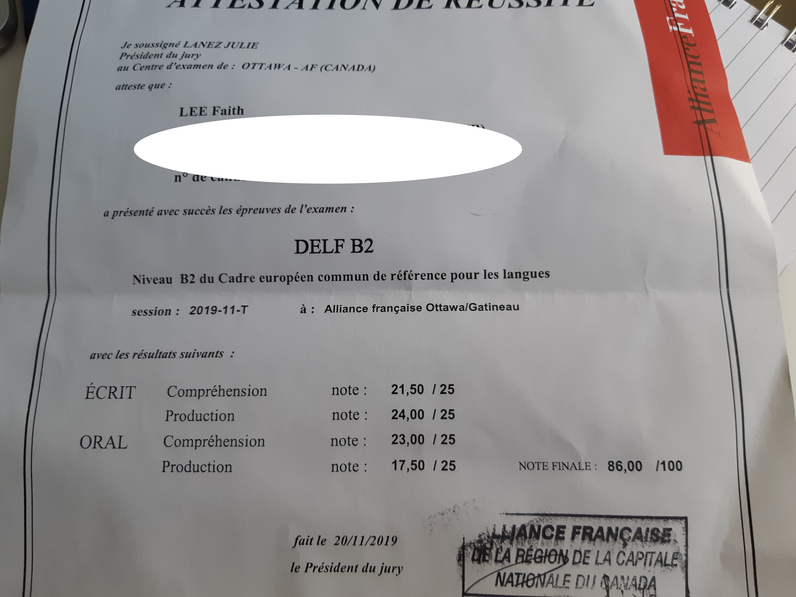

I made it a point to myself that before 2019 ends this year, I will sit for the DELF B2 exam. And I succeeded!

<strong>What is the DELF (Diplôme d'Études en Langue Française) exam?</strong>

It is an exam offered by the French Ministry of Education to validate the competency of non-native French speakers. They are split into 4 levels in increasing level of difficulty: A1, A2, B1 and B2. There is then the DALF exam for proficient users (C1 and C2). There are other exam frameworks such as the TEF and TCF. The difference between TCF/TEF and DELF is that TCF/TEF would have one exam that evaluates you and puts you into the A1-C2 level based on your scores whereas DELF is a level-specific exam.

<strong>Why I am taking the exam? </strong>

The B2 level is seen as a passport for job/study opportunities in France/Quebec. Francophone universities require minimum of DELF B2 in their admissions.

<strong>How I prepared as a full-time adult: </strong>

Sources estimate the time to reach B2 level takes about 500 to 600 hours of learning however YMMV. Between A1 to B2, I recognize I had about a year of prep work. As a working adult, I probably commit 10 hours a week (actively/passively learning) and here's what I did which has been identified in the post <a href="https://randomstatsmusings.wordpress.com/2019/05/24/tips-on-picking-up-french/">linked</a>:
<ul>
	<li>On the way to work/On the way back from work: I would listen to the French radio such as <a href="https://www.francetvinfo.fr/en-direct/radio.html">France Info</a>. If you are starting out, I would recommend <a href="https://www.youtube.com/channel/UCI4xp8qHD1MDErkqxb1dPbA">Inner French</a>'s podcast as its meant for intermediate learners and he speaks slow enough and enunciates all the words clearly. The goal of listening to France Info is not to 100% understand everything, but to understand what they are talking about and be able to recognize some vocabulary. Gradually, you will be able to improve your listening skills and understand more details each time you listen to a radio/podcast. I also recommend <a href="https://savoirs.rfi.fr/en">RFI</a> site to test practise your listening skills.</li>
	<li>At work:  I will continue listening to podcasts or tune into France24/FranceInfo if what I am doing is not too demanding.</li>
	<li><a href="https://www.italki.com">Italki</a> lessons: I have been using Italki for about a year now. Thanks to the teachers and tutors, I have been able to improve my pronunciation, writing, speaking and to understand specific nuances of the language. For example, we use 'perte de temps' rather than 'gaspillage de temps' to indicate waste of time. It gave me an opportunity to speak and be corrected. You can find a teacher that suits your budget. The only downside is whether your teacher can stay committed. Some users might be here for only short time to try out teaching or they might take a break. As a result, I found it hard to stick to just having lessons with one teacher. I would be taking about 2 to 3 lessons per week.</li>
	<li>Meetups: Search for local language meetups/exchange in your area. In my area, every Saturday, they have a Eng-French exchange group. The advantage is you train yourself in holding basic social conversations in French, downside is you might find it hard to improve outside of the basic social conversation topics you discuss.</li>
	<li>Reading: I cannot emphasize the importance of starting with reading <strong>children's books meant for 5 year olds</strong>.  The key is to get used to how sentences are formed in the language, reinforce the conjugations. After a few months of doing so, I started reading Harry Potter.  and articles from FranceCulture, Lemonde.fr.</li>
</ul>
Putting incremental amounts of effort slowly goes a long way in learning anything!

Now that I have passed the exam, and while its not as major as C1 level,  I spend between 30 minutes to 1 hour a day on the language through youtube, reading and once a week lesson with a tutor on italki.

Thanks for reading and I will be happy to answer any questions or comments you have!